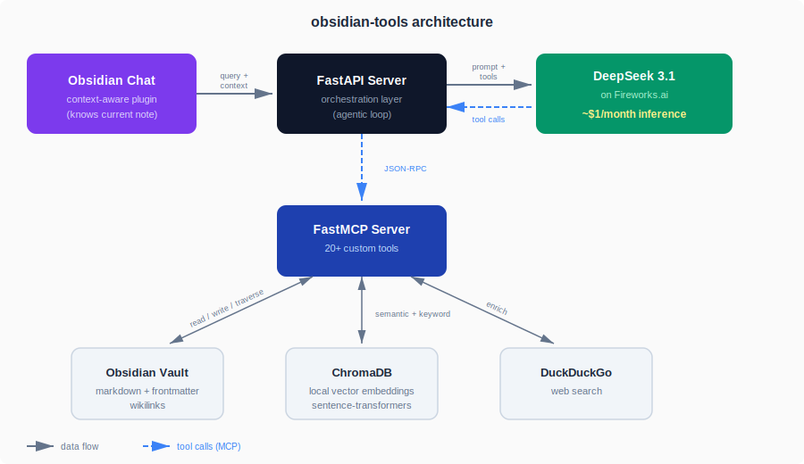

# CLAUDE.md - Obsidian Tools

## Project Overview

This project provides semantic search and interaction logging for an Obsidian vault. It has two operational modes:

**Development (Claude Code)**: Use Claude Code to develop and maintain the vault tools themselves—adding features, fixing bugs, refactoring code. Claude Code does not interact with vault content directly.

**Vault Interaction (Agent)**: The LLM agent (`src/agent.py`) handles user queries about vault content. It connects to the MCP server, searches the vault, and logs interactions to daily notes.

## Architecture



**Directory Structure:**

```
src/
├── mcp_server.py        # Entry point - registers tools from submodules
├── services/
│   ├── chroma.py        # Shared ChromaDB connection management
│   ├── compaction.py    # Tool message compaction (shared by API + CLI)
│   └── vault.py         # Path resolution, response helpers, utilities
├── tools/
│   ├── files.py         # read_file, create_file, move_file, append_to_file
│   ├── frontmatter.py   # list_files_by_frontmatter, update_frontmatter, etc.
│   ├── links.py         # find_backlinks, find_outlinks, search_by_folder
│   ├── preferences.py   # save_preference, list_preferences, remove_preference
│   ├── search.py        # search_vault, web_search
│   ├── sections.py      # prepend_to_file, replace_section, append_to_section
│   ├── utility.py       # log_interaction, get_current_date
│   └── audio.py         # transcribe_audio
├── config.py            # Environment configuration
├── api_server.py        # FastAPI HTTP wrapper
├── agent.py             # CLI chat client (loads system prompt from system_prompt.txt)
├── hybrid_search.py     # Semantic + keyword search with RRF
├── search_vault.py      # Search interface
├── index_vault.py       # ChromaDB indexing
└── log_chat.py          # Daily note logging

install.sh               # macOS/Linux installer
install.ps1              # Windows installer
uninstall.sh             # macOS/Linux uninstaller
uninstall.ps1            # Windows uninstaller

services/
├── systemd/             # Linux systemd unit templates
│   ├── obsidian-tools-api.service
│   ├── obsidian-tools-indexer.service
│   └── obsidian-tools-indexer-scheduler.timer
├── launchd/             # macOS launchd plist templates
│   ├── com.obsidian-tools.api.plist
│   └── com.obsidian-tools.indexer.plist
└── taskscheduler/       # Windows Task Scheduler XML templates
    ├── obsidian-tools-api.xml
    └── obsidian-tools-indexer.xml
```

**Components:**

- **mcp_server.py**: Entry point that registers all tools with FastMCP
- **services/chroma.py**: Shared ChromaDB connection management (lazy singletons)
- **services/vault.py**: Shared utilities for path resolution, response formatting, section finding, file scanning
- **services/compaction.py**: Tool message compaction (`build_tool_stub`, `compact_tool_messages`) used by the API server between requests
- **tools/**: Tool implementations organized by category. All tools return structured JSON via `ok()`/`err()` helpers.
- **plugin/**: Obsidian plugin providing a chat sidebar UI
- **api_server.py**: FastAPI HTTP wrapper with file-keyed session management; compacts tool messages between requests
- **agent.py**: CLI chat client that connects the LLM (via Fireworks) to the MCP server; loads system prompt from `system_prompt.txt` at startup (falls back to `system_prompt.txt.example`); includes agent loop cap, tool result truncation, and synthetic `get_continuation` tool for retrieving truncated results in chunks
- **hybrid_search.py**: Combines semantic (ChromaDB) and keyword search with RRF ranking. Keyword search uses a single `$or` query with `limit=200` instead of N per-term queries. Returns `heading` metadata from chunks in search results.
- **index_vault.py**: Indexes vault content into ChromaDB using structure-aware chunking (splits by headings, paragraphs, sentences). Frontmatter is indexed as a dedicated chunk with wikilink brackets stripped for searchability. Each chunk carries `heading` and `chunk_type` metadata and is prefixed with `[Note Name]` for search ranking. Chunks are batch-upserted per file. Also builds a wikilink reverse index (`link_index.json`) for O(1) backlink lookups. Runs via systemd, not manually. Use `--full` flag to force full reindex.
- **log_chat.py**: Appends interaction logs to daily notes. `add_wikilinks` uses strip-and-restore to protect fenced code blocks, inline code, URLs, and existing wikilinks from being wikified.

## MCP Tools

These tools are exposed by the MCP server. Documentation here is for development reference.

| MCP Tool | Purpose | Parameters |
|----------|---------|------------|
| `search_vault` | Hybrid search (semantic + keyword) | `query` (string), `n_results` (int, default 5), `mode` (string: "hybrid"\|"semantic"\|"keyword", default "hybrid") |
| `read_file` | Read content of a vault note | `path` (string: relative to vault or absolute), `offset` (int, default 0), `length` (int, default 4000) |
| `list_files_by_frontmatter` | Find files by frontmatter criteria | `field` (string), `value` (string), `match_type` (string: "contains"\|"equals", default "contains"), `limit` (int, default 100), `offset` (int, default 0) |
| `update_frontmatter` | Modify frontmatter on a vault file | `path` (string), `field` (string), `value` (string, optional), `operation` (string: "set"\|"remove"\|"append", default "set") |
| `batch_update_frontmatter` | Apply frontmatter update to multiple files | `paths` (list[str]), `field` (string), `value` (string, optional), `operation` (string: "set"\|"remove"\|"append", default "set") |
| `move_file` | Relocate a file within the vault | `source` (string), `destination` (string) |
| `batch_move_files` | Move multiple files to new locations | `moves` (list[dict] with "source" and "destination" keys) |
| `create_file` | Create a new markdown note | `path` (string), `content` (string, default ""), `frontmatter` (JSON string, optional) |
| `find_backlinks` | Find files linking to a note | `note_name` (string: note name without brackets or .md), `limit` (int, default 100), `offset` (int, default 0) |
| `search_by_date_range` | Find files by date range | `start_date` (YYYY-MM-DD), `end_date` (YYYY-MM-DD), `date_type` ("created"\|"modified", default "modified"), `limit` (int, default 100), `offset` (int, default 0) |
| `find_outlinks` | Extract wikilinks from a file | `path` (string: relative to vault or absolute), `limit` (int, default 100), `offset` (int, default 0) |
| `search_by_folder` | List files in a folder | `folder` (string), `recursive` (bool, default false), `limit` (int, default 100), `offset` (int, default 0) |
| `log_interaction` | Log interactions to daily note | `task_description`, `query`, `summary`, `files` (optional list), `full_response` (optional string) |
| `save_preference` | Save a user preference | `preference` (string) |
| `list_preferences` | List all saved preferences | (none) |
| `remove_preference` | Remove a preference by line number | `line_number` (int, 1-indexed) |
| `get_current_date` | Get current date | (none) |
| `append_to_file` | Append content to end of file | `path` (string), `content` (string) |
| `prepend_to_file` | Insert content after frontmatter | `path` (string), `content` (string) |
| `replace_section` | Replace a markdown section | `path` (string), `heading` (string), `content` (string) |
| `append_to_section` | Append content to end of a section | `path` (string), `heading` (string), `content` (string) |
| `web_search` | Search the web via DuckDuckGo | `query` (string) |
| `transcribe_audio` | Transcribe audio embeds in a note | `path` (string: note path with audio embeds) |

### search_vault

Searches the Obsidian vault using hybrid search (semantic + keyword by default). The `mode` parameter controls the search strategy:
- `"hybrid"` (default): Runs both semantic and keyword search, merges results using Reciprocal Rank Fusion.
- `"semantic"`: Vector similarity search only.
- `"keyword"`: Exact keyword matching only, ranked by number of query terms found.

**Returns:** JSON response
- Success with results: `{"success": true, "results": [{"source": "path.md", "content": "...", "heading": "## Section Name"}]}`
- Success with no matches: `{"success": true, "message": "No matching documents found", "results": []}`
- Error: `{"success": false, "error": "description"}`

The `heading` field indicates which markdown section the result came from (e.g., `"## Meeting Notes"`, `"### Action Items"`). It may be `"top-level"` for content before the first heading, or empty for older chunks indexed before this metadata was added.

### read_file

Reads content of a vault note with pagination for long files. Accepts either a relative path (from vault root) or an absolute path.

Parameters:
- `path`: Path to the note (relative to vault root or absolute)
- `offset`: Character position to start reading from (default 0)
- `length`: Maximum characters to return (default 4000)

For files that fit within `length`, returns the full content with no markers (backward compatible). For longer files, appends a truncation marker with the offset needed to read the next chunk. When reading with a non-zero offset, prepends a continuation header.

Security measures:
- Rejects paths that escape the vault (path traversal protection)
- Blocks access to excluded directories (`.obsidian`, `.git`, etc.)

### list_files_by_frontmatter

Finds vault files matching frontmatter criteria. Useful for queries like "find all meeting notes" or "find files tagged as person".
- `field`: The frontmatter field to check (e.g., `tags`, `company`, `project`)
- `value`: The value to match
- `match_type`: `"contains"` checks if value is in a list or substring of a string; `"equals"` requires exact match
- `limit`: Maximum results to return (default 100)
- `offset`: Number of results to skip (default 0)
- Returns matching file paths with `total` count

### update_frontmatter

Updates frontmatter on a vault file, preserving body content.
- `operation`: `"set"` to add/modify a field, `"remove"` to delete, `"append"` to add to a list
- `value`: For complex values (lists), use JSON: `'["tag1", "tag2"]'`
- Append creates the list if field doesn't exist, and skips duplicates

### batch_update_frontmatter

Applies the same frontmatter update to multiple files. Useful for bulk operations like archiving projects or adding tags to a group of files.
- Same field/value/operation semantics as `update_frontmatter`
- Continues processing after individual failures
- Returns summary showing successes and failures

### move_file

Moves a vault file to a different location within the vault.
- Creates target directory if it doesn't exist
- Prevents moves outside the vault (both paths validated)
- Prevents overwriting existing files

### batch_move_files

Moves multiple files to new locations in a single operation.
- `moves`: List of objects like `{"source": "old/path.md", "destination": "new/path.md"}`
- Creates destination directories if needed
- Continues processing after individual failures
- Returns summary showing successes and failures

### create_file

Creates a new markdown note in the vault.
- `frontmatter`: Pass as JSON string (e.g., `'{"tags": ["meeting"]}'`), auto-converted to YAML
- Creates parent directories if needed
- Prevents overwriting existing files

### find_backlinks

Finds all vault files containing wikilinks to a given note name. Uses a pre-built link index (`link_index.json` in `CHROMA_PATH`) for O(1) lookups, falling back to a full vault scan if the index doesn't exist.
- `note_name`: The note name to search for (without `[[]]` brackets or `.md` extension)
- `limit`: Maximum results to return (default 100)
- `offset`: Number of results to skip (default 0)
- Matches both `[[note_name]]` and `[[note_name|alias]]` patterns
- Case-insensitive matching (matches Obsidian behavior)
- Returns sorted list of relative file paths with `total` count

### search_by_date_range

Finds vault files within a specified date range.
- `start_date`, `end_date`: Date range (inclusive), format YYYY-MM-DD
- `date_type`: `"created"` uses frontmatter `Date` field (falls back to filesystem creation time), `"modified"` uses filesystem mtime
- `limit`: Maximum results to return (default 100)
- `offset`: Number of results to skip (default 0)
- Handles wikilink date format in frontmatter (`[[2023-08-11]]`)
- Returns sorted list of relative file paths with `total` count

### find_outlinks

Extracts all wikilinks from a given vault file.
- `path`: Path to the note to analyze
- `limit`: Maximum results to return (default 100)
- `offset`: Number of results to skip (default 0)
- Returns deduplicated, sorted list of linked note names with `total` count
- Handles aliased links: `[[note|alias]]` returns just "note"

### search_by_folder

Lists all markdown files in a vault folder.
- `folder`: Path to the folder to list
- `recursive`: If `true`, include files in subfolders (default: `false`)
- `limit`: Maximum results to return (default 100)
- `offset`: Number of results to skip (default 0)
- Returns sorted list of relative file paths with `total` count

### log_interaction

Logs an interaction to today's daily note. For conversational logs, pass `summary: "n/a"` and provide the `full_response` parameter instead.

### save_preference

Saves a user preference to `Preferences.md` at the vault root. Preferences are stored as bullet points.
- Creates the file if it doesn't exist
- Use for user corrections, preferences, or instructions the agent should remember

### list_preferences

Returns all saved preferences with line numbers (1-indexed). Use this to show users what preferences are saved.

### remove_preference

Removes a preference by its line number.
- `line_number`: 1-indexed line number from `list_preferences` output
- Returns error if line number is out of range

**Note**: The LLM agent loads its system prompt from `system_prompt.txt` at startup (falling back to `system_prompt.txt.example` with a warning). It also loads `Preferences.md` and appends it as a "User Preferences" section that the agent follows.

### get_current_date

Returns the current date in YYYY-MM-DD format. Useful for agents that need to know today's date for date-based queries or logging.

### prepend_to_file

Inserts content at the beginning of a vault file, after any YAML frontmatter.
- `path`: Path to the note (relative to vault or absolute)
- `content`: Content to prepend

**Behavior:**
- If the file has YAML frontmatter (opening `---` at position 0), content is inserted immediately after the closing `---` with a blank line separator
- If no frontmatter, content is inserted at the very beginning of the file
- Inserted content is followed by a blank line to separate it from existing content

**Returns:** JSON response
- Success: `{"success": true, "path": "relative/path.md"}`
- Error: `{"success": false, "error": "description"}`

**Error cases:**
- File not found
- Path outside vault (path traversal protection)
- Path in excluded directory (`.obsidian`, `.git`, etc.)

### replace_section

Replaces a markdown heading and its content with new content.
- `path`: Path to the note (relative to vault or absolute)
- `heading`: Full heading text including `#` symbols (e.g., "## Meeting Notes")
- `content`: Replacement content (can include a heading or not)

**Behavior:**
- Finds heading by case-insensitive exact match (heading level must match exactly)
- A "section" includes the heading line through to the next heading of same or higher level, or EOF
- Replaces the entire section (heading + content) with the provided replacement
- Headings inside fenced code blocks (``` or ~~~) are ignored

**Returns:** JSON response
- Success: `{"success": true, "path": "relative/path.md"}`
- Error: `{"success": false, "error": "description"}`

**Error cases:**
- File not found
- Path outside vault (path traversal protection)
- Path in excluded directory
- Heading not found
- Multiple headings match (includes line numbers where matches were found)
- Invalid heading format (no `#` prefix)

### append_to_section

Appends content at the end of a section (just before the next same-or-higher-level heading or EOF).
- `path`: Path to the note (relative to vault or absolute)
- `heading`: Full heading text including `#` symbols (e.g., "## Context")
- `content`: Content to append to the section (may be multiline)

**Behavior:**
- Finds heading by case-insensitive exact match (heading level must match exactly)
- Finds section boundary (next heading of same or higher level, or EOF)
- Appends content at the end of the section, just before that boundary
- Adds a blank line before inserted content to separate from existing content
- Preserves the heading and all existing section content (this is append, not replacement)
- Headings inside fenced code blocks (``` or ~~~) are ignored

**Returns:** JSON response
- Success: `{"success": true, "path": "relative/path.md"}`
- Error: `{"success": false, "error": "description"}`

**Error cases:**
- File not found
- Path outside vault (path traversal protection)
- Path in excluded directory
- Heading not found
- Multiple headings match (includes line numbers where matches were found)
- Invalid heading format (no `#` prefix)

### web_search

Searches the web using DuckDuckGo.
- `query`: Search query string

**Returns:** JSON response
- Success with results: `{"success": true, "results": [{"title": "...", "url": "...", "snippet": "..."}]}`
- Success with no matches: `{"success": true, "message": "No web results found", "results": []}`
- Error: `{"success": false, "error": "description"}`

### transcribe_audio

Transcribes audio files embedded in a vault note using Fireworks Whisper API.
- `path`: Path to the note containing audio embeds (relative to vault or absolute)

**Audio Embed Format:** Parses Obsidian embeds like `![[recording.m4a]]`. Supported formats: m4a, webm, mp3, wav, ogg.

**Audio File Resolution:** Audio files are resolved from the `Attachments` folder in the vault root.

**API Requirements:**
- Requires `FIREWORKS_API_KEY` environment variable
- Uses Whisper v3 model with speaker diarization enabled

**Returns:** JSON response
- Success with transcripts: `{"success": true, "results": [{"file": "recording.m4a", "transcript": "..."}]}`
- Success with no embeds: `{"success": true, "message": "No audio embeds found", "results": []}`
- Partial success: `{"success": true, "results": [...], "errors": [...]}`
- All failed: `{"success": false, "error": "All transcriptions failed: ..."}`

**Error cases:**
- `FIREWORKS_API_KEY` not set
- Note file not found
- Audio file not found in Attachments folder
- Whisper API failure

**Typical workflow:**
1. Agent calls `transcribe_audio(path)` to get transcript
2. Agent summarizes the transcript using LLM
3. Agent calls `append_to_section(path, "## Summary", "...")` to save the summary

## Vault Service Helpers

The `services/vault.py` module provides shared utilities used across all tools.

### Response Helpers

All tools use these helpers for consistent JSON responses:

```python
from services.vault import ok, err

# Success responses
ok("Operation completed")           # {"success": true, "message": "..."}
ok(results=[...])                   # {"success": true, "results": [...]}
ok(path="file.md")                  # {"success": true, "path": "file.md"}

# Error responses
err("File not found")               # {"success": false, "error": "..."}
err("Invalid path", path="bad.md")  # {"success": false, "error": "...", "path": "..."}
```

### Path Resolution

```python
from services.vault import resolve_file, resolve_dir, resolve_vault_path

# Resolve and validate a file (returns tuple)
file_path, error = resolve_file("notes/file.md")
if error:
    return err(error)

# Resolve and validate a directory
dir_path, error = resolve_dir("notes")

# Low-level path resolution (raises ValueError)
path = resolve_vault_path("notes/file.md")
```

### Code Fence Detection

```python
from services.vault import is_fence_line

is_fence_line("```python")  # True
is_fence_line("~~~")        # True
is_fence_line("hello")      # False
```

Shared helper used by both `find_section` (vault.py) and `_split_by_headings` (index_vault.py) for consistent code fence detection.

### Section Finding

```python
from services.vault import find_section

lines = file_content.split("\n")
start, end, error = find_section(lines, "## Section Name")
if error:
    return err(error)
# start = line index of heading, end = line index where section ends
```

### File Scanning

```python
from services.vault import get_vault_files, get_vault_note_names

# Get all markdown files (excludes .venv, .obsidian, etc.)
files = get_vault_files()  # list[Path]

# Get note names without .md extension
note_names = get_vault_note_names()  # set[str]

# Both accept optional vault_path parameter
files = get_vault_files(custom_vault_path)
```

## ChromaDB Service

The `services/chroma.py` module provides shared ChromaDB connection management using lazy singletons.

```python
from services.chroma import get_client, get_collection, reset

# Get ChromaDB client (creates on first call)
client = get_client()

# Get the obsidian_vault collection
collection = get_collection()

# Reset singletons (for testing)
reset()
```

## Testing

The project includes a pytest test suite in `tests/`.

### Running Tests

```bash
# Run all tests
.venv/bin/python -m pytest tests/ -v

# Run specific test file
.venv/bin/python -m pytest tests/test_vault_service.py -v

# Run with coverage (if pytest-cov installed)
.venv/bin/python -m pytest tests/ --cov=src
```

### Test Structure

```
tests/
├── conftest.py                  # Fixtures: temp_vault, vault_config
├── test_agent.py                # Tests for agent loop cap, truncation, compaction
├── test_api_context.py          # Tests for API context handling
├── test_chunking.py             # Tests for chunking, frontmatter indexing, search, keyword optimization, link index
├── test_session_management.py   # Tests for tool compaction, session routing, /chat integration
├── test_log_chat.py             # Tests for wikilink insertion and protected zones
├── test_vault_service.py        # Tests for services/vault.py, is_fence_line
├── test_tools_files.py          # Tests for file operations
├── test_tools_sections.py       # Tests for section manipulation
├── test_tools_links.py          # Tests for link operations, pagination
└── test_tools_audio.py          # Tests for audio transcription
```

### Key Fixtures

- **`temp_vault`**: Creates a temporary vault directory with sample files
- **`vault_config`**: Patches `VAULT_PATH` across all modules to use `temp_vault`
- **`sample_frontmatter_file`**: File with YAML frontmatter for testing

### Writing New Tests

All tools return JSON strings. Parse with `json.loads()` and assert on structured fields:

```python
import json

def test_my_tool(vault_config):
    """vault_config fixture patches VAULT_PATH to temp directory."""
    # Create test file
    (vault_config / "test.md").write_text("# Test")

    # Call tool and parse JSON response
    result = json.loads(my_tool("test.md"))
    assert result["success"] is True
    assert "expected" in result["content"]
```

## Installation

Cross-platform install scripts handle Python detection, venv creation, dependency installation, `.env` configuration, and background service setup:

```bash
# macOS / Linux
./install.sh

# Windows (PowerShell)
.\install.ps1
```

The installers resolve the **real** Python binary path (not pyenv shims) when creating the venv, which is critical for launchd/systemd service contexts.

Companion uninstall scripts (`uninstall.sh`, `uninstall.ps1`) reverse service installation. They preserve `.env` and `.chroma_db/`.

Service templates in `services/` use `__PLACEHOLDER__` style (`__PROJECT_DIR__`, `__VENV_PYTHON__`, `__USERNAME__`, `__INDEX_INTERVAL__`, `__INDEX_INTERVAL_SEC__`) that the installers substitute at install time.

## Configuration

All paths are configured via `.env`:
- `VAULT_PATH`: Path to Obsidian vault (default: `~/Documents/obsidian-vault`)
- `CHROMA_PATH`: Path to ChromaDB database (default: `./.chroma_db` relative to project)
- `FIREWORKS_API_KEY`: API key for Fireworks (used by LLM agent)
- `FIREWORKS_MODEL`: Fireworks model ID (default: `accounts/fireworks/models/deepseek-v3p1`, env: `FIREWORKS_MODEL`). Falls back to `LLM_MODEL` env var for backward compatibility.
- `API_PORT`: Port for the HTTP API server (default: `8000`)
- `INDEX_INTERVAL`: How often the vault indexer runs, in minutes (default: `60`). Used by the install scripts to configure service timer intervals.

Additional configuration in `config.py`:
- `EXCLUDED_DIRS`: Directories to skip when scanning vault (`.venv`, `.chroma_db`, `.trash`, `.obsidian`, `.git`)
- `PREFERENCES_FILE`: Path to user preferences file (`VAULT_PATH / "Preferences.md"`)
- `ATTACHMENTS_DIR`: Path to audio/image attachments (`VAULT_PATH / "Attachments"`)
- `FIREWORKS_MODEL`: Model ID for the LLM agent (reads `FIREWORKS_MODEL` env, falls back to `LLM_MODEL`)
- `LLM_MODEL`: Backward compat alias for `FIREWORKS_MODEL`
- `API_PORT`: API server port (default: `8000`, env: `API_PORT`)
- `INDEX_INTERVAL`: Indexer interval in minutes (default: `60`, env: `INDEX_INTERVAL`)
- `WHISPER_MODEL`: Whisper model for audio transcription (default: `whisper-v3`, env: `WHISPER_MODEL`)

Constants in `agent.py`:
- `MAX_TOOL_RESULT_CHARS`: Maximum character length for tool results before truncation (default: `4000`)
- `SYSTEM_PROMPT_FILE`: Path to `system_prompt.txt` (loaded once at startup)
- `SYSTEM_PROMPT_EXAMPLE`: Path to `system_prompt.txt.example` (fallback if `system_prompt.txt` missing)

## HTTP API

The API server (`src/api_server.py`) provides HTTP access to the LLM agent. It binds to `127.0.0.1` on the port specified by `API_PORT` (default `8000`, localhost only) for security.

### Running the Server

```bash
python src/api_server.py
```

### POST /chat

Send a message and receive the agent's response.

**Request:**
```json
{
  "message": "Find notes about projects",
  "session_id": "optional-uuid",
  "active_file": "Projects/Marketing.md"
}
```

**Response:**
```json
{
  "response": "I found 3 notes about projects...",
  "session_id": "abc123-uuid"
}
```

**Behavior:**
- `active_file` determines session continuity (see Session Management below)
- `session_id` is returned for reference but routing is by `active_file`
- Include `active_file` to provide context about the currently viewed note (enables "this note" references)

### Session Management

Sessions are keyed by `active_file`, not by UUID. This prevents token explosion from unbounded conversation history.

**Routing rules:**
- Same `active_file` as previous request: continues the existing session
- Different `active_file`: starts or resumes a separate session for that file
- `null` / omitted `active_file`: gets its own dedicated session
- Switching back to a previously used file resumes that file's session

**Token management — tool compaction:**
Tool messages in session history are replaced with compact stubs containing only lightweight metadata. This prevents tool results from accumulating across requests and exploding the prompt size. Compaction logic lives in `services/compaction.py` and runs only in `api_server.py` after each `agent_turn` completes — **not** within `agent_turn` itself, so the LLM retains full tool results throughout a single turn for multi-step research queries.

Example stub:
```json
{"status": "success", "result_count": 5, "files": ["Notes/foo.md", "Notes/bar.md"]}
```

The `_compacted` flag on tool messages tracks which have been compacted. It is stripped in `api_server.py` before each `agent_turn` call so it never reaches the Fireworks API.

**Token management — tool result truncation:**
Individual tool results are truncated to `MAX_TOOL_RESULT_CHARS` (4000) characters before being appended to message history. Truncated results include the `tool_call_id` and character counts so the LLM can call `get_continuation(tool_call_id, offset)` to retrieve more.

**Tool result continuation:**
When a tool result is truncated, the full result is cached in-memory for the duration of the `agent_turn` call. A synthetic `get_continuation` tool is injected into the tool list and handled directly by `agent_turn` (no MCP round-trip). The LLM can call it repeatedly with increasing offsets to retrieve the full result in 4000-char chunks. `get_continuation` calls are excluded from the iteration cap count. The cache is freed when the turn ends.

**Agent loop safeguard:**
The `agent_turn` function has a `max_iterations` parameter (default 20). If the LLM keeps requesting tool calls beyond this limit, the loop stops and returns whatever response has been generated so far, appended with `\n\n[Tool call limit reached]`. Calls to `log_interaction` and `get_continuation` are excluded from the count — iterations where all tool calls are uncounted tools do not increment the counter.

**Storage:**
- Sessions are stored in-memory as `file_sessions: dict[str | None, Session]` (lost on server restart)
- Each `Session` holds a `session_id` (UUID), `active_file`, and `messages` list
- The MCP connection is shared across all sessions

## Obsidian Plugin (Optional)

The `plugin/` directory contains an optional Obsidian plugin that provides a chat sidebar for interacting with the vault agent. The core functionality (MCP server, API server, CLI agent) works independently without the plugin.

### Plugin Structure

```
plugin/
├── src/
│   ├── main.ts        # Plugin entry point
│   └── ChatView.ts    # Sidebar view component
├── styles.css         # Chat UI styling
├── manifest.json      # Plugin metadata
├── package.json       # Dependencies
├── tsconfig.json      # TypeScript config
└── esbuild.config.mjs # Build script
```

### Building the Plugin

```bash
cd plugin
npm install
npm run build
```

### Installing in Obsidian

1. Copy `manifest.json`, `main.js`, and `styles.css` to your vault's `.obsidian/plugins/vault-chat/` directory
2. Enable "Vault Chat" in Obsidian Settings → Community Plugins
3. Ensure the API server is running (`python src/api_server.py`)

### Features

- Ribbon icon to open/close chat sidebar
- Command palette: "Open Vault Chat"
- Session continuity across messages
- Loading indicator during API calls
- Error handling when server is unavailable
- Active file context: automatically sends the currently open note's path with each message, enabling natural references like "summarize this note"

---

## Development Workflow

When adding features or making non-trivial changes, follow this process:

### 1. Planning Phase

Before writing code, enter planning mode:
- Describe the feature requirements and constraints
- Identify affected files and potential side effects
- Create a GitHub issue with:
  - Clear description of the feature
  - Implementation approach
  - Success criteria (specific, testable)
  - Testing/validation steps

Example issue template:
```markdown
## Description
[What and why]

## Implementation Approach
[How - files to modify, new functions, etc.]

## Success Criteria
- [ ] Criterion 1
- [ ] Criterion 2

## Testing
- [ ] Test case 1
- [ ] Test case 2
```

### 2. Implementation Phase

```bash
# Create feature branch
git checkout -b feature/description

# Do the work...

# Validate against success criteria
# Run tests if applicable

# Self-review before marking complete
```

**Before considering implementation complete, verify:**
- [ ] Meets all success criteria from the issue
- [ ] Separation of concerns (no god functions)
- [ ] DRY - no duplicated logic
- [ ] Clean, idiomatic Python
- [ ] Functions are focused and under ~50 lines
- [ ] Error handling is appropriate
- [ ] Logging is useful but not excessive

If criteria are not met, continue iterating in the feature branch.

### 3. Merge Phase

Only after all criteria are met:

```bash
git checkout main
git merge feature/description
git push
# Close the GitHub issue
```

**Never commit directly to main for non-trivial changes.**

---

## Coding Standards

### Structure
- **No god functions**: Break large functions into smaller, focused ones
- **DRY**: Extract repeated logic into helper functions
- **Single responsibility**: Each function does one thing well
- **Max function length**: ~50 lines (guideline, not hard rule)

### Style
- **Clear naming**: Functions and variables should be self-documenting
- **Type hints**: Use them for function signatures
- **Docstrings**: Required for any function that isn't immediately obvious
- **Imports**: Standard library → third-party → local (separated by blank lines)

### Error Handling
- Fail gracefully with useful error messages
- Don't swallow exceptions silently
- Log errors appropriately

### Example

```python
# Good
def get_vault_notes(vault_path: Path, excluded_dirs: set[str]) -> set[str]:
    """Return set of note names (without .md extension) from vault."""
    notes = set()
    for md_file in vault_path.rglob("*.md"):
        if any(excluded in md_file.parts for excluded in excluded_dirs):
            continue
        notes.add(md_file.stem)
    return notes

# Bad
def process(p):  # unclear name, no types, no docstring
    n = set()
    for f in p.rglob("*.md"):
        if '.venv' in str(f) or '.chroma_db' in str(f) or '.trash' in str(f):  # duplicated logic
            continue
        n.add(f.stem)
    return n
```

---

## Notes

- The `.venv/` and `.chroma_db/` directories are tooling, not content
- Daily notes are in `Daily Notes/YYYY-MM-DD.md` within the vault
- The vault's "tags" frontmatter field describes content types: task, project, meeting, recipe, etc.
